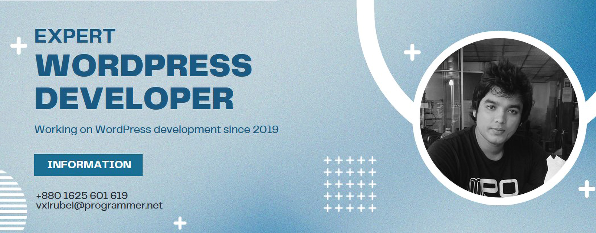

# Self-Introduction

Hi, I'm Rubel Mahmud (Sujan), a passionate WordPress developer with a deep love for crafting web experiences that are not only visually stunning but also highly functional and user-friendly. I've been immersed in the world of WordPress development since 2019 and have since honed my skills to create elegant, efficient, and secure websites.

## I dedicate my time to...

💻 As a seasoned WordPress developer, I specialize in:

- Advanced WordPress theme development
- WordPress plugins development
- WordPress WooCommerce Development
- Website performance/speed optimize
- Responsive web design
- E-commerce solutions with WooCommerce
- Integration of third-party APIs
- Website security and maintenance
- WordPress REST API

I'm constantly exploring the latest trends and technologies in web development to deliver the best solutions to my clients.

## Technologies

- MySQL ( Expert )
- PHP ( Expert )
- Javascript ( Intermidiate )
- jQuery UI
- jQuery
- Bootstrap
- CSS/CSS3
- html

## Developing new skills

💻 I always love to learn new technologies.

- Laravel : PHP framework
- Vue.js : Javascript framework

## Get in contact with me

📫 You can reach out to me through the following channels:

## Get in Touch

I'm always open to collaboration and am eager to share my knowledge. Whether it's discussing a project, sharing ideas, or just connecting with fellow developers, feel free to reach out. Let's build the web together!

Looking forward to connecting with you and exploring the possibilities of WordPress development.
